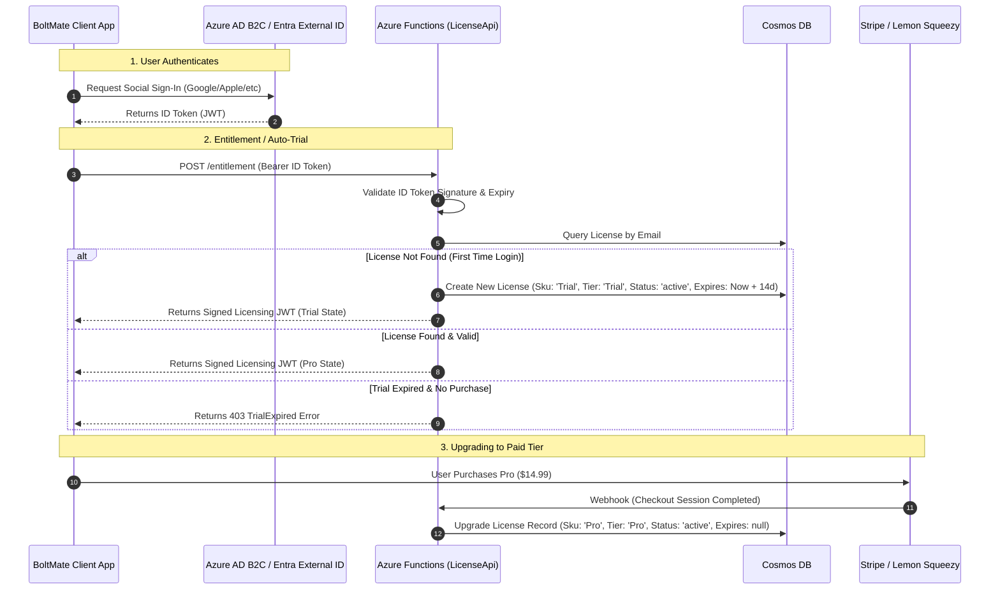

# BoltMate: Serverless Identity & Licensing Architecture

This document proposes a zero-maintenance, low-cost Azure-native architecture to support user login (social-only), automatic 14-day trial provisioning, and upgrade workflows to paid options.

---

## 1. Core Architecture Overview

To achieve **$0/month hosting costs** (under the free tiers) while avoiding identity management complexity, we leverage:

1.  **Identity Provider: Azure AD B2C** or **Microsoft Entra External ID for Customers**
    *   **Cost:** First **50,000 Monthly Active Users (MAU)** are **$0/month**.
    *   **Login Providers:** Google, Apple, Facebook, GitHub, and Microsoft out of the box.
    *   **Benefit:** Emits a secure, standard OpenID Connect (OIDC) JWT (`id_token`). Your app and APIs only validate the token; you never store passwords or handle login pages.
2.  **Database: Azure Cosmos DB (Free Tier / Serverless)**
    *   **Cost:** First **1,000 RU/s throughput and 25 GB storage** are **$0/month**.
    *   **Benefit:** Extremely fast document storage for user licenses and activation logs.
3.  **API Layer: Azure Functions (Consumption Tier)**
    *   **Cost:** First **1,000,000 executions/month** are **$0/month**.
    *   **Benefit:** Already implemented in your project; handles entitlement validation and Stripe/Lemon Squeezy checkout webhooks.



---

## 2. 14-Day Trial & Licensing Logic Design

Rather than blocking users or requiring them to checkout for a trial, we **automatically provision the trial upon their first login**.

### Entitlement Validation Flow

Update [EntitlementFunction.cs](file:///Users/jallen/Workspace/jaredballen/BoltMate/src/BoltMate.LicenseApi/Functions/EntitlementFunction.cs) to intercept missing licenses:

```csharp
var license = await _licenses.GetByEmailAsync(validated.Email, ct).ConfigureAwait(false);
if (license is null)
{
    // Auto-provision 14-day trial
    license = new LicenseRecord
    {
        Id = $"lic_{Guid.NewGuid():N}",
        Email = validated.Email,
        Sku = LicenseSkus.Trial,
        Tier = LicenseTier.Trial,
        Status = "active",
        IssuedAt = DateTimeOffset.UtcNow,
        ExpiresAt = DateTimeOffset.UtcNow.AddDays(14)
    };
    await _licenses.UpsertAsync(license, ct).ConfigureAwait(false);
}

// Check expiration for trials
if (license.Tier == LicenseTier.Trial && license.ExpiresAt < DateTimeOffset.UtcNow)
{
    return Error(HttpStatusCode.Forbidden, EntitlementErrorCodes.TrialExpired, "Your 14-day trial has expired.");
}
```

### Stripe Webhook Upgrade Flow

Update [StripeWebhookHandler.cs](file:///Users/jallen/Workspace/jaredballen/BoltMate/src/BoltMate.LicenseApi/Services/StripeWebhookHandler.cs) to convert the trial license to a perpetual license:

```csharp
private async Task HandleCheckoutCompletedAsync(Session session, CancellationToken ct)
{
    var email = session.CustomerDetails?.Email ?? session.CustomerEmail;
    if (string.IsNullOrWhiteSpace(email)) return;

    var existingLicense = await _licenses.GetByEmailAsync(email, ct).ConfigureAwait(false);

    var record = existingLicense ?? new LicenseRecord { Id = $"lic_{Guid.NewGuid():N}" };
    record.Email = email;
    record.Sku = LicenseSkus.Pro;
    record.Tier = LicenseTier.Pro;
    record.Status = "active";
    record.IssuedAt = DateTimeOffset.UtcNow;
    record.ExpiresAt = null; // Paid license never expires
    record.StripeCustomerId = session.CustomerId;
    record.StripeCheckoutSessionId = session.Id;

    await _licenses.UpsertAsync(record, ct).ConfigureAwait(false);
}
```

---

## 3. Azure Identity Provider Evaluation: AD B2C vs. Entra External ID

Since you want Google, Apple, Facebook, GitHub, and Microsoft logins on a free tier, here is how the two Azure options compare:

| Feature | Azure AD B2C | Microsoft Entra External ID |
| :--- | :--- | :--- |
| **Free Tier Limit** | **50,000 MAU** | **50,000 MAU** |
| **Price above Free Tier** | $0.00325 per MAU | $0.00325 per MAU |
| **Google/Facebook/Apple** | Supported natively | Supported natively (Apple in Public Preview) |
| **GitHub Login** | Supported natively | Supported (requires custom OpenID Connect setup) |
| **Microsoft Accounts** | Supported natively | Supported natively |
| **Status in Azure** | Mature, standard product | Microsoft's next-gen replacement (CIAM) |
| **Verdict** | **Recommended for GitHub-heavy tools** | **Recommended for Apple/modern UX tools** |

> [!TIP]
> **Identity Recommendation:** Since developers and sysadmins are BoltMate's primary audience, **GitHub login** is a crucial, high-conversion auth provider. **Azure AD B2C** is currently the safer choice because it supports GitHub natively as a social identity provider. If you use Entra External ID, you have to configure GitHub manually as a custom OpenID Connect provider.

---

## 4. Key Security & Implementation Risks

1.  **Mandatory Verified Email Enforcement (SSO Security Boundary):**
    *   **Architectural Decision:** Locked-in as a mandatory architectural requirement. The system must only allow registration and entitlement checks for accounts with verified email addresses.
    *   **Implementation:** Configure Azure AD B2C flows to require email verification (OTP code check) during user sign-up/login for any third-party providers (such as GitHub) that do not enforce email verification natively. The backend token validator must inspect and reject tokens that do not carry a verified email claim.
2.  **Trial Farming:**
    *   **The Risk:** Technical users can create burner Google or GitHub accounts every 14 days to exploit the auto-trial.
    *   **Mitigation:** Store the machine's hardware ID (e.g., motherboard UUID or NIC MAC address hash) in the local secure storage. When registering a trial, transmit the Hardware ID to the API. If a hardware ID has already claimed a trial within the last 12 months, refuse to auto-provision a new trial, regardless of the new email address.
3.  **Local Clock Manipulation:**
    *   **The Risk:** Users can rollback their computer's system clock to extend their local token validity.
    *   **Mitigation:** The client licensing library [LicenseGate.cs](file:///Users/jallen/Workspace/jaredballen/BoltMate/src/BoltMate.Licensing/LicenseGate.cs) enforces a dynamic JWT refresh schedule. Ensure the local client periodically queries the backend server clock during the activation Policy check, and invalidates the cache if the local clock drifts significantly.
