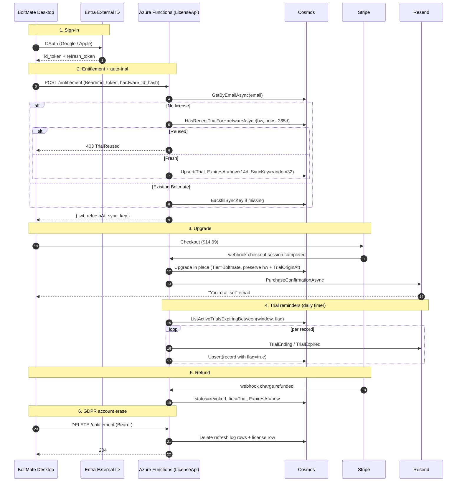

# BoltMate: Serverless Identity & Licensing Architecture

This document describes the production licensing + identity stack as it
ships. The original Phase-0 design proposal is preserved at the bottom
for context; the sections above it reflect the codebase as of Phase 6.

---

## 1. Production stack (live)

| Concern | Choice | Why |
| :--- | :--- | :--- |
| Identity | **Microsoft Entra External ID** (`boltmateauth.onmicrosoft.com`) | First 50k MAU free. Google + Apple wired; Facebook cut (Meta Business Verification). LinkedIn + GitHub deferred. |
| OAuth scopes | `openid email profile offline_access` | Email is the partition key in Cosmos; `sub` is the stable trust anchor. |
| Database | **Cosmos DB Serverless** — `Licenses` + `RefreshLog` containers, both partitioned on email / licenseId | 1k RU/s + 25 GB free tier. |
| API | **Azure Functions Consumption Tier** (`BoltMate.LicenseApi`) | 1M executions/mo free. |
| Email | **Resend** transactional + Cloudflare Email Routing for inbound | $0/mo at this volume. |
| Payments | **Stripe Checkout** — single Price (lookup key `boltmate_lifetime`) at $14.99 USD | One-time charge, no subscription state. |
| Site host | **Azure Static Web Apps Free** | Astro static build pulls live price from Stripe at build time. |
| Site rebuild | `repository_dispatch` from LicenseApi on `price.updated` | Dashboard price edits go live without a manual deploy. |
| Cross-machine trust | **Per-account AES-GCM SyncKey** (32 random bytes, server-minted, distributed via `/api/entitlement`) | Hostname-string filtering replaced by cryptographic decrypt-success — see [TcpFrame envelope](../src/BoltMate.Core/Topology/Messages/TcpFrame.cs) and [AesGcmPeerCryptoProvider](../src/BoltMate.Core/Topology/AesGcmPeerCryptoProvider.cs). |

### Tier shape

Two SKUs only:

- **Trial** — auto-provisioned on first `/api/entitlement` POST, 14-day
  expiry, scoped to one HardwareIdHash (SHA-256 of OS UUID). The
  hardware-ID hash blocks re-trial farming for 12 months even across
  different email accounts on the same machine.
- **Boltmate** (the paid lifetime tier) — minted by the Stripe webhook
  on `checkout.session.completed`. Upgrade preserves the existing
  record's `HardwareIdHash` + `TrialOriginAt` so the 12-mo block stays
  enforceable through any future refund. Refund inverts: `Status =
  "revoked"`, `Tier = Trial`, `ExpiresAt = now`.

No "Free" or "None" tier exists — unentitled state is signalled by
absence of a record (or the desktop client failing to validate its
cached JWT signature).

### Email reminders

`TrialReminderFunction` runs daily at 14:00 UTC and sweeps active Trial
licenses through three calendar-day windows: T-3, T-1, and just-expired.
Per-stage boolean flags on `LicenseRecord` guarantee one send per stage
even on timer misfire. Resend templates live inline in
[`ResendEmailNotifier`](../src/BoltMate.LicenseApi/Services/ResendEmailNotifier.cs).

---

## 2. End-to-end sequence

---

## 3. Peer trust ring (AES-GCM SyncKey)

Pre-Phase-5 BoltMate filtered cross-machine messages by hostname-string
matching against local `HostBindings.ReceiverName`. That was a UX hint,
not a security boundary — the LAN was implicitly trusted.

Phase 5 inverted it: the trust ring is now **cryptographic**.

- `SyncKeyBase64` lives on `LicenseRecord`. Minted at Trial provisioning,
  preserved through Stripe upgrade + refund, returned to the client in
  every `/api/entitlement` response.
- The client cache (the `LicenseGate`'s stored envelope) holds the key
  alongside the JWT and exposes it via `IPeerCryptoKeySource`.
- `AesGcmPeerCryptoProvider` wraps every UDP datagram and every TCP frame
  in `nonce(12) || ciphertext || tag(16)`. AES-256 (32-byte key) by
  default; AES-128 if the key is 16 bytes; any other length disables
  peer comms entirely.
- Decrypt success is the trust signal. Hostname mismatch is downgraded
  to a UX hint via `HostnameAdvisoryService` — "you signed in here but
  haven't paired peripherals yet."

Static per-account key for v1; per-session ephemeral DH for forward
secrecy is tracked as a future upgrade (see `memory/project_todo_peer_dh.md`).

---

## 4. Key security + implementation risks

1.  **Mandatory verified email.** Entra External ID flows enforce email
    verification for any IdP that doesn't natively (no provider currently
    in use bypasses this, but the constraint is encoded as a token
    validator check on the LicenseApi side).
2.  **Trial farming.** Hardware-ID hash check at trial provisioning
    blocks re-trial for 12 months across email accounts. GDPR delete
    intentionally leaves the hardware-reuse signal in place by hashing
    on the hardware-side (delete only wipes license + refresh log rows).
3.  **Local clock manipulation.** JWT expiry is a server-issued claim; a
    skewed local clock just means the cached JWT looks expired earlier,
    forcing an entitlement refresh. The refresh path re-validates against
    the server clock.
4.  **Stripe live mode swap.** Production still runs Stripe sandbox. The
    swap is the last step before public launch — replace CLI test key
    with a Restricted Key (read for site build, full for webhook),
    refresh webhook signing secret, verify the live-mode dashboard
    price keeps the `boltmate_lifetime` lookup key.

---

## 5. Original Phase-0 design proposal (kept for reference)

> The following section is the unmodified original architecture proposal
> from when the licensing stack was first scoped. The current implementation
> diverges in several places (`Pro` → `Boltmate`, B2C-only language vs the
> Entra External ID we actually run, no mention of SyncKey or trial-reminder
> emails). Use Sections 1–4 above for ground truth; this section only
> documents the design history.

### Original architecture overview

To achieve **$0/month hosting costs** (under the free tiers) while avoiding identity management complexity, we leverage:

1.  **Identity Provider: Azure AD B2C** or **Microsoft Entra External ID for Customers**
    *   **Cost:** First **50,000 Monthly Active Users (MAU)** are **$0/month**.
    *   **Login Providers:** Google, Apple, Facebook, GitHub, and Microsoft out of the box.
    *   **Benefit:** Emits a secure, standard OpenID Connect (OIDC) JWT (`id_token`). Your app and APIs only validate the token; you never store passwords or handle login pages.
2.  **Database: Azure Cosmos DB (Free Tier / Serverless)**
    *   **Cost:** First **1,000 RU/s throughput and 25 GB storage** are **$0/month**.
    *   **Benefit:** Extremely fast document storage for user licenses and activation logs.
3.  **API Layer: Azure Functions (Consumption Tier)**
    *   **Cost:** First **1,000,000 executions/month** are **$0/month**.
    *   **Benefit:** Already implemented in your project; handles entitlement validation and Stripe/Lemon Squeezy checkout webhooks.

### Original 14-day trial & licensing logic design

Rather than blocking users or requiring them to checkout for a trial, we **automatically provision the trial upon their first login**. (Implemented in `EntitlementFunction.cs` — see Section 2 sequence diagram above for the production shape.)

### Original IdP evaluation: AD B2C vs. Entra External ID

| Feature | Azure AD B2C | Microsoft Entra External ID |
| :--- | :--- | :--- |
| **Free Tier Limit** | **50,000 MAU** | **50,000 MAU** |
| **Price above Free Tier** | $0.00325 per MAU | $0.00325 per MAU |
| **Google/Facebook/Apple** | Supported natively | Supported natively (Apple in Public Preview) |
| **GitHub Login** | Supported natively | Supported (requires custom OpenID Connect setup) |
| **Microsoft Accounts** | Supported natively | Supported natively |
| **Status in Azure** | Mature, standard product | Microsoft's next-gen replacement (CIAM) |

> **Decision shipped:** Entra External ID. Facebook was cut over Meta
> Business Verification cost; LinkedIn + GitHub deferred. See
> `memory/project_b2c_resources.md` for tenant + app registration IDs.
