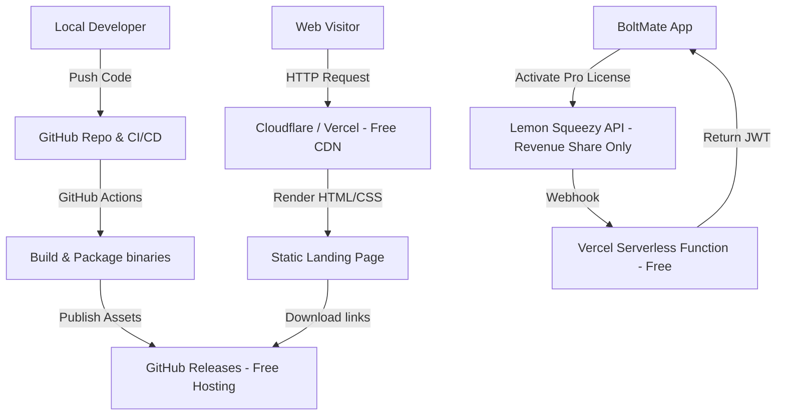

# BoltMate: Market Feasibility Analysis & Go-To-Market Plan

This document outlines the market viability of **BoltMate**, analyzes the competitive landscape (both commercial and open-source), examines the primary failure modes of Logitech's official software, identifies technical gaps in our current architecture, and proposes a zero-budget go-to-market strategy.

---

## 1. Market Feasibility & Pain Points

The target audience for BoltMate consists of power users, developers, sysadmins, and creative professionals who work with multiple computers (e.g., a personal Mac and a corporate Windows laptop) and use Logitech's premium MX-series or ergonomics peripherals.

Logitech Options+ is notorious for several major issues, creating a strong market pull for a lightweight, reliable companion tool:

### Key Pain Points in Logitech Options+

1. **Resource Bloat & Performance Degradation**
   - **RAM/CPU Hogging:** The official Logi Options+ package spawns multiple background helper daemons (e.g., `logioptionsplus_agent.exe` on Windows). Users frequently report cumulative memory usage exceeding 300–500 MB RAM and periodic CPU spikes of 15-20% due to background telemetry and clipboard synchronization.
   - **Feature Creep:** Logitech has integrated heavy, unwanted features into the utility, such as the "Logi AI Prompt Builder" and mandatory cloud-sync integrations. Power users actively seek minimalist, native alternatives that do one thing well.

2. **Logitech Flow Flakiness (Network Dependency)**
   - **Network Blockades:** Logitech Flow requires both machines to be connected to the exact same local network subnet, allowing multicast DNS (mDNS) traffic. Corporate VPNs, strict enterprise firewalls, and isolated network subnets (e.g., Ethernet vs. Wi-Fi) completely break Flow.
   - **Wake-from-Sleep Issues:** Flow frequently fails to reconnect after a host wakes from sleep mode, requiring users to manually restart the Logitech agent or reboot their machine.

3. **Enhanced Easy-Switch Limitations**
   - **Restricted Device Support:** Logitech's newer "Enhanced Easy-Switch" syncs the mouse to the keyboard, but it is officially locked to a small list of newer devices (e.g., MX Keys S, MX Keys Mini, MX Master 3S). Older Bolt and Unifying keyboards (like the original MX Keys or Craft) are completely excluded.
   - **Uni-Directional Synchronization:** The official implementation is strictly keyboard-to-mouse. If a user presses the Easy-Switch button on the *mouse* (or switches hosts via another device), the keyboard does not follow.
   - **No Cross-Receiver Logic:** If a user uses multiple Bolt receivers (common in multi-monitor setups or to work around signal interference), Logitech's software cannot coordinate host switches across them.

---

## 2. Competitive Landscape

| Solution | Platform | Core Mechanism | Cost | Pros | Cons / Gaps |
| :--- | :--- | :--- | :--- | :--- | :--- |
| **Logitech Flow / Enhanced Easy-Switch** | macOS / Windows | Network coordination (Flow) / Proprietary keyboard-driven routing | Free (Bundled with hardware) | Official support, GUI, clipboard sharing, file transfer | High RAM/CPU usage, network-dependent, limited hardware support, uni-directional sync |
| **CleverSwitch** (Open Source) | macOS, Windows, Linux | Python background daemon sniffing and writing to receivers | Free (MIT) | Free, lightweight, cross-platform, supports custom hook scripts | CLI-only (complex configuration), requires Python runtime, lacks GUI tray, does not support receiver admin |
| **Solaar** (Open Source) | Linux only | Python utility communicating directly via `/dev/hidraw` | Free (GPLv2) | Powerful receiver administration, pairing, device settings control | Linux-only, heavy GTK interface, complex setup for non-technical users |
| **Software KVMs** (Deskflow / Synergy / Mouse Without Borders) | Cross-platform | Network-based cursor and keyboard event forwarding | Free to $59 | Works with any hardware, clipboard sharing | Network latency, jitter, blocked by corporate VPNs/firewalls, requires a powered-on "server" machine |
| **BoltMate** (Ours) | macOS / Windows | .NET 9 native tray app sniffing Options+ writes and fanning out via Bolt management interfaces | Freemium ($0 / Pro tier) | Coexists with Options+, GUI tray interface, bidirectional fan-out, multi-receiver support, local backup/restore | No Bluetooth-only support, macOS Input Monitoring permission required, Bolt-only (no Unifying) |

---

## 3. Product Gaps & Technical Considerations

While BoltMate has a strong foundation, we must address several gaps and prioritize user experience polish before bringing it to market:

### ⚠️ Critical Technical Gaps & Roadmap Priorities

> [!WARNING]
> **1. Bluetooth-Only Connection Limitation (Crucial Roadmap Target)**
> BoltMate communicates directly with the Logitech Bolt USB receiver (VID `0x046D`, PID `0xC548`). Many laptop users (especially macOS users lacking USB-A ports) connect their keyboard and mouse directly via Bluetooth. 
> * **Impact:** The app will not detect or switch devices connected purely via Bluetooth. 
> * **High Priority Target:** In our roadmap, we must actively prioritize research into supporting Bluetooth-connected devices (via raw HID++ over OS-level Bluetooth sockets). For the initial v1 launch, we must clearly document this requirement to save support overhead, but adding native Bluetooth support is the single greatest opportunity to unlock the mainstream consumer market.

> [!IMPORTANT]
> **2. Unifying Receiver Support (Legacy Devices)**
> A massive install base of Logitech users still relies on older Unifying receivers (VID `0x046D`, PID `0xC52B`) for devices like the standard MX Keys, MX Master 3 (non-S), and K780.
> * **Impact:** BoltMate currently ignores Unifying receivers.
> * **High Priority Target:** Adding Unifying receiver compatibility (detecting VID `0xC52B` and parsing HID++ 1.0 register maps) should be prioritized for a fast follow-on release. Supporting Unifying will double our addressable market of power users who haven't upgraded their entire desk setups to Bolt.

> [!CAUTION]
> **3. Windows Long HID Write Failures (Issue #31)**
> On Windows 11 (especially under Arm64/x64 emulation), long HID writes (`0x11` frames) to the Bolt management interface throw `ERROR_INVALID_FUNCTION`.
> * **Impact:** This completely blocks Pro features (unpair, clear, pair new devices) on Windows.
> * **Mitigation:** Resolve the Windows HID write issue prior to launch. We may need to fall back to `SendFeatureReport` or adjust buffer alignment/report IDs specifically for Windows.

> [!NOTE]
> **4. macOS Input Monitoring Permission Friction & UX Polish**
> macOS requires users to grant "Input Monitoring" permissions in System Settings for the app to read raw USB HID reports.
> * **Impact:** High user drop-off during onboarding if they see security warnings.
> * **Mitigation:** Build a friendly, visual onboarding step in the Avalonia app that explains *why* this is needed (coexisting with Logi Options+ by reading physical button events) and guides them to the system settings panel.

> [!TIP]
> **5. User Experience (UX) Polish & Friction Reduction**
> System tray utilities that require special permissions or hardware coordination are highly sensitive to user friction.
> * **Impact:** Non-technical users will quickly uninstall if the app crashes, fails to guide them through permissions, or has a raw, unstyled configuration screen.
> * **Mitigation:** Prioritize high visual aesthetics in the Avalonia UI (Phase 2), featuring beautiful, native-looking tray settings, animated permissions walkthroughs, helpful device badges (Free/Pro/Standby), and instant feedback notifications during device identification. Minimizing cognitive load is essential to selling a premium utility.

---

## 4. Zero-Budget Developer & Hosting Stack

To achieve the goal of **free or minimal-cost development and hosting**, we can leverage the following modern cloud offerings. This allows us to run the entire infrastructure for **$0/month** (excluding a custom domain).

### Infrastructure Stack (100% Free Tiers)

1. **Continuous Integration & Delivery (CI/CD): GitHub Actions**
   - **Cost:** $0 (Free for public repositories; includes 2,000 free minutes/month for private repositories).
   - **Usage:** Set up workflows to compile .NET 9 code, bundle `libhidapi`, and package self-contained executables (notarized macOS `.app` / `.dmg` and Windows `.msi` / `.exe`).

2. **Asset & Download Hosting: GitHub Releases**
   - **Cost:** $0 (Unlimited bandwidth and storage).
   - **Usage:** Host the installation bundles directly on GitHub Releases. We can use a script to fetch the latest download link dynamically.

3. **Landing Page & Documentation: Vercel or Cloudflare Pages**
   - **Cost:** $0 (Generous bandwidth limits, globally distributed edge CDN).
   - **Usage:** Deploy a static landing page built with vanilla HTML/CSS or a lightweight framework. Include setup instructions, troubleshooting FAQs, and clear call-to-actions for downloading the app.

4. **License Management & Payments: Lemon Squeezy (or Gumroad)**
   - **Cost:** $0 monthly fee (Revenue-share model: ~5% + $0.50 per successful sale).
   - **Merchant of Record (MoR):** Both services act as the MoR. They handle VAT, sales tax calculation, tax remittance, and receipt generation globally. This eliminates thousands of dollars in compliance and accounting costs.
   - **Key Generation:** Lemon Squeezy automatically generates license keys upon purchase and provides a simple validation API.

5. **Activation Verification Server: Vercel Serverless / Cloudflare Workers**
   - **Cost:** $0 (Vercel offers 100k requests/day free; Cloudflare Workers offers 100k requests/day free).
   - **Usage:** A simple Node.js or C# WebAssembly serverless function that listens for Lemon Squeezy purchase webhooks, verifies keys, and signs the JWT returned to the `BoltMate.Licensing` client.

6. **Custom Domain (Optional but Recommended)**
   - **Cost:** ~$10–$12 / year (e.g., `boltmatex.com` or `boltswitcher.app` from Namecheap, Cloudflare, or Porkbun). This is the only hard cost required to build trust.

---

## 5. Marketing & Distribution Strategy

With a $0 marketing budget, we must rely entirely on organic channels, developer communities, search engine optimization (SEO), and virality.

### Organic Channel Distribution

#### 1. Reddit: Solving Active User Pain Points
Reddit is the single best source of high-intent traffic for utility tools. Monitor the following subreddits:
* **Target Communities:** `r/logitech`, `r/mac`, `r/windows`, `r/hardware`, `r/sysadmin`, `r/productivity`.
* **Strategy:** Do not spam. Search for historical and active threads asking:
  - *"How do I make my Logitech mouse follow my keyboard switch?"*
  - *"Logitech Options+ high memory leak alternative"*
  - *"Logi Flow not working over VPN/firewall"*
* Write detailed replies explaining *why* Options+ fails (network dependence, memory overhead) and offer BoltMate as a lightweight, secure companion that runs offline.

#### 2. Hacker News: "Show HN"
The Hacker News audience is composed of developers and system administrators who appreciate lightweight, single-purpose system utilities.
* **Strategy:** Write a "Show HN" post detailing the technical hurdles overcome:
  * How the app coexists with Options+ using non-exclusive HID opens (`hid_darwin_set_open_exclusive(0)`).
  * Sniffing HID++ 2.0 frames (`0x1814` SetCurrentHost writes).
  * Synchronizing cross-receiver topologies.
* Keep it open-source-friendly: Developers love inspecting source code before installing background utilities that require input monitoring permissions.

#### 3. GitHub SEO & Social Proof
Developers find tools directly through GitHub searches.
* **Strategy:** Optimize the repository tags and description:
  - Tags: `logitech-flow`, `logi-options-plus-alternative`, `mx-master`, `mx-keys`, `easy-switch-sync`, `logi-bolt`, `hid-api`.
  - Include an interactive SVG or screen recording showing the instantaneous fan-out switch.
  - Pin instructions on how to install via package managers (e.g., Homebrew, Winget) to make installation friction-free.

#### 4. Package Manager Distribution (Free & High Trust)
Integrating into system package managers builds trust and automates updates:
* **macOS:** Submit a formula to **Homebrew Cask** (`brew install --cask boltmatex-switcher`).
* **Windows:** Submit a manifest to **Windows Package Manager (Winget)** (`winget install boltmatex`).
* This eliminates Gatekeeper / SmartScreen friction for technical users, as package managers run their own hash verifications.

---

## 6. Monitization: Freemium Tiering

To maximize adoption while securing revenue, we should keep the core utility free while charging a one-time fee for advanced, administrative, and multi-monitor features.

### Feature Matrix

| Feature | Free Tier | Pro Tier (One-time $9.99 purchase) |
| :--- | :--- | :--- |
| **Unified Switch Sync** | Yes (Single Receiver) | Yes (Multi-Receiver coordination) |
| **Device Enumeration** | Yes (Battery, Firmware, Serial) | Yes |
| **Logi Options+ Coexistence** | Yes | Yes |
| **Local Backup to JSON** | Yes | Yes |
| **Tap-to-Identify** | Yes | Yes |
| **Receiver Management** | Read-Only | **Write-to-Flash** (Unpair slot, Clear receiver, Move pairings) |
| **Device Pairing Wizard** | CLI-only | **GUI wizard with passcode UI** |
| **System Autostart Manager** | Yes | Yes |

### Why this pricing works:
* **Low Friction:** Everyday users get the core "follow-me" capability for free. They get immediate value, which fuels word-of-mouth recommendations.
* **Pro Features Target High-Value Tasks:** Users managing multiple devices, setting up home/office rigs with multiple receivers, or needing clean device administration (like IT admins clearing hardware) are highly willing to pay a nominal one-time fee ($9.99) to unlock write features.

---

## 7. Recommended Action Plan

To execute this plan with minimal cost and maximum efficiency, follow these steps:

1. **Resolve Technical Roadblocks & Polish UX:**
   - Fix the Windows long write issue ([Issue #31](file:///Users/jallen/Workspace/jaredballen/LogiPlusXSwitcher/CLAUDE.md#L183)) to unblock Pro features.
   - Design and build the **Avalonia onboarding UI** to reduce permission friction (clear instructions on macOS Input Monitoring settings).
   - Add explicit warnings in the app's initial launch screen alerting users that Bluetooth-only connections are not supported in the current version.
2. **Define the Roadmap for Expansion:**
   - Design the Unifying receiver scanner (detecting VID `0xC52B` and legacy HID++ 1.0 frames) as a fast-follow update.
   - Research raw HID++ command transmission over OS-level Bluetooth sockets to build a pipeline for Bluetooth-only users.
3. **Build the Serverless Licensing Hook:**
   - Set up a free Lemon Squeezy store.
   - Deploy a simple Cloudflare Worker/Vercel serverless function to validate keys and sign JWTs.
4. **Set Up the Static Landing Page:**
   - Create a single-page HTML website hosted on Vercel/Cloudflare Pages.
   - Embed screenshots or a GIF demonstrating the synchronized switching.
   - Highlight the roadmap (Unifying and Bluetooth support) to build community excitement.
5. **Publish & Distribute:**
   - Compile binaries using GitHub Actions and publish to GitHub Releases.
   - Submit manifests to Homebrew Cask and Winget to bypass Gatekeeper/SmartScreen friction.
6. **Launch & Organic Outreach:**
   - Post on Hacker News ("Show HN") targeting tech-savvy developers.
   - Monitor and answer relevant threads on Reddit.
