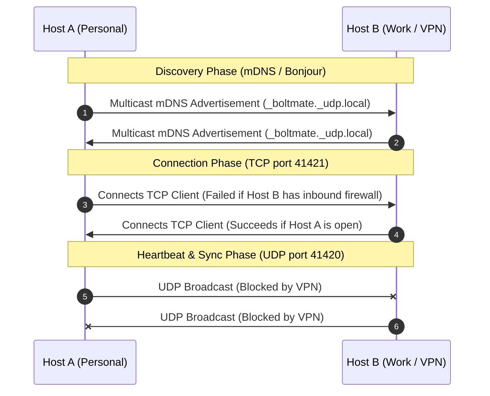

# BoltMate: Network Sync Architecture & VPN Compatibility Analysis

This document provides a deep-dive analysis of BoltMate's cross-machine synchronization layer. It evaluates how the current **UDP Heartbeat + Bonjour/mDNS + TCP** design behaves under typical corporate VPN and firewall restrictions, determines feasibility, and proposes concrete engineering solutions to mitigate connection failures.

---

## 1. Current Network Sync Architecture

BoltMate relies on two independent network transport layers in [UdpTopologyService.cs](file:///Users/jallen/Workspace/jaredballen/BoltMate/src/BoltMate.Core/Topology/UdpTopologyService.cs) and [MdnsTcpChannel.cs](file:///Users/jallen/Workspace/jaredballen/BoltMate/src/BoltMate.Core/Topology/MdnsTcpChannel.cs) to synchronize device switch events across machines:



### Transport 1: UDP Broadcast / Multicast
*   **Implementation:** [UdpTopologyService.cs](file:///Users/jallen/Workspace/jaredballen/BoltMate/src/BoltMate.Core/Topology/UdpTopologyService.cs) binds to UDP port `41420`.
*   **Behavior:** Periodically broadcasts and multicasts length-prefixed JSON announcements containing paired devices and battery levels to `255.255.255.255` and `239.255.41.42`. 
*   **Dynamic Cadence:** When a device link-lost or link-up event fires, the broadcast cadence tightens from once every 2 seconds to once every **200ms** for a 3-second burst window to ensure peers capture the switch.

### Transport 2: Bonjour/mDNS + TCP Backchannel
*   **Implementation:** [MdnsTcpChannel.cs](file:///Users/jallen/Workspace/jaredballen/BoltMate/src/BoltMate.Core/Topology/MdnsTcpChannel.cs) advertises `_boltmate._udp.local` via mDNS and binds a `TcpListener` to port `41421`.
*   **Behavior:** 
    1.  Uses Bonjour to discover peer IP addresses and their listening ports.
    2.  Resolves peer IP addresses and automatically spawns an outbound `TcpClient` to connect directly to each peer.
    3.  Feeds announcements into the UDP dedup pipeline via `InjectInbound`.

---

## 2. Behavior Under Common VPN Topologies

Corporate VPN clients (e.g., Cisco AnyConnect, Palo Alto GlobalProtect, FortiClient) severely restrict local network traffic. We analyze how BoltMate fares under three common corporate security profiles.

### Topology A: Full-Tunnel VPN (No Local LAN Access)
*   **Behavior:** The VPN client routes all IPv4/IPv6 traffic (including local LAN subnets) through the virtual network interface (TUN/TAP) to the corporate gateway.
*   **Impact on BoltMate:**
    *   **UDP Heartbeats:** Fail. Broadcasts/multicasts are routed down the tunnel and dropped.
    *   **mDNS / Bonjour:** Fails. Multicast queries to `224.0.0.251` are blocked locally or dropped.
    *   **TCP Connections:** Fail. Attempts to connect to any local private IP (e.g., `192.168.1.x`) are intercepted and sent to the VPN gateway, resulting in timeouts.

### Topology B: Split-Tunnel VPN with Multicast/Broadcast Filtering
*   **Behavior:** The VPN client allows traffic destined for the home subnet (e.g., `192.168.1.0/24`) to bypass the tunnel, but strictly filters multicast (`224.0.0.0/4`) and broadcast (`255.255.255.255`) traffic to prevent local network scanning.
*   **Impact on BoltMate:**
    *   **UDP Heartbeats:** Fail. Broadcasts are filtered.
    *   **mDNS / Bonjour:** Fails. Bonjour cannot discover peer IPs.
    *   **TCP Connections:** Blocked due to discovery failure. Even though unicast TCP traffic to a local IP is physically permitted by the routing table, `MdnsTcpChannel` never learns the peer's IP address and cannot establish the connection.

### Topology C: Split-Tunnel VPN with Inbound Port Filtering (Most Common)
*   **Behavior:** The VPN client permits local LAN routing and outbound local connections, but applies local firewall policies that block all inbound TCP/UDP ports on the work machine (acting as a server).
*   **Impact on BoltMate:**
    *   **UDP Heartbeats:** Fails or behaves unidirectionally.
    *   **mDNS / Bonjour:** Succeeds (multicast traffic resolves peer IPs).
    *   **TCP Connections:** Partially blocks. 
        *   The work computer (VPN) can successfully connect *outbound* to the personal computer's TCP port `41421`.
        *   The personal computer *cannot* connect inbound to the work computer's TCP port `41421` (blocked by firewall).
        *   **CRITICAL CODE LIMITATION:** In the current code, `MdnsTcpChannel` only writes outgoing announcements to `_peerClients` (which are populated strictly by *outbound* connection attempts in `EnsureClientFor`). The inbound sockets accepted in `AcceptLoopAsync` are only read from, not written to.
        *   **Result:** The work machine can tell the personal machine to switch, but the personal machine cannot send switch commands back to the work machine, causing **unidirectional sync failure**.

---

## 3. Verdict: Will the Current Method Navigate These?

> [!WARNING]
> **A) Verdict: No, not reliably without modifications.**
> While the dual-transport design (UDP + TCP) is excellent, it will fail to maintain bidirectional sync in all three scenarios.
> *   In **Full-Tunnel (A)** and **Filtered Split-Tunnel (B)**, discovery fails completely, leaving the TCP listener unreachable.
> *   In **Blocked Inbound (C)**, connection succeeds in one direction, but because the TCP sockets are not used in a full-duplex manner, bidirectional sync is broken.

---

## 4. Risk Mitigation & Code Enhancements (Implementation Plan)

To make BoltMate resilient to corporate VPN environments, we recommend implementing the following mitigations, ordered by priority of execution.

### [PRIORITY 1] Mitigation 1: Upgrade to Full-Duplex TCP Connections
Modify [MdnsTcpChannel.cs](file:///Users/jallen/Workspace/jaredballen/BoltMate/src/BoltMate.Core/Topology/MdnsTcpChannel.cs) to reuse inbound TCP connections for outbound announcements. If the work computer successfully connects to the personal computer, the personal computer must save that socket and send its outgoing announcements back through the same stream.

```diff
// In MdnsTcpChannel.cs
private async Task AcceptLoopAsync(CancellationToken ct)
{
    while (!ct.IsCancellationRequested && _listener is not null)
    {
        TcpClient peer = await _listener.AcceptTcpClientAsync(ct).ConfigureAwait(false);
-       _ = Task.Run(() => ReadLoopAsync(peer, ct));
+       // 1. Identify peer's machineId from the first announcement it sends us.
+       // 2. Add this socket to the _peerClients map so BroadcastToPeers can write to it.
+       _ = Task.Run(() => HandleIncomingPeerDuplexAsync(peer, ct));
    }
}
```
*   **Why this is Priority 1:** VPN firewalls almost always permit outbound TCP connections even when inbound is blocked. Reusing the socket for duplex communication guarantees bidirectional sync as long as *one* machine can reach the other. This requires zero configuration from the user.

### [PRIORITY 2] Mitigation 2: Manual Peer IP Configuration (mDNS Bypass)
Add a "Static Peer IP" configuration setting in the UI. If a user enters an IP address manually:
1.  Bypass the mDNS discovery phase entirely for that peer.
2.  Have `MdnsTcpChannel` attempt to establish a TCP connection to that IP periodically.
*   **Why this works:** This solves the discovery issue in **Topology B** (multicast blocked). Since split-tunnels route unicast local traffic, direct TCP connections to a manual IP will bypass the multicast filter.

### [PRIORITY 3] Mitigation 3: TCP Heartbeat Fallback
If direct TCP connections fail due to inbound firewall filtering on both ends, implement a periodic UDP unicast heartbeat. If Peer A knows Peer B's IP, it can send unicast UDP packets directly to Peer B's UDP port `41420`. Unicast UDP is often ignored by firewalls that block TCP handshakes.

### [UX SUPPORT] Mitigation 4: Local Network Diagnostics UI
Since you are offering a **14-day free trial**, provide a diagnostic tab in the settings window. Show the state of `UdpHealth` and `MdnsHealth`/`TcpHealth`. 
*   If both show `Blocked` with a detail message pointing to a VPN, display a helpful message:
    > *"It looks like you are on a corporate VPN. To enable multi-computer switching, please manually configure your peer's local IP address or enable 'Allow Local LAN Access' in your VPN client settings."*

---

## 5. Advanced Local-Only Bypasses & Risks of Failure

If standard unicast TCP/UDP connections are still blocked by strict corporate VPN software, you can implement these three local-only bypasses. Below is an elaboration of each option along with its **risks of not working for the user**:

### Option 1: Bluetooth Personal Area Network (PAN) Bridging
*   **The Concept:** Users pair their macOS and Windows machines over Bluetooth and enable Bluetooth PAN sharing. This creates a virtual network interface (e.g., `bt0`) on both machines with private IP addresses (e.g., `192.168.50.x`).
*   **Why it works under VPN:** Corporate VPN clients typically ignore secondary interfaces like Bluetooth PAN. Traffic sent over the Bluetooth network interface bypasses the VPN tunnel entirely.
*   **Risks of NOT working for the user:**
    1.  **High User Configuration Friction (Major Risk):** Enabling Bluetooth PAN requires the user to pair devices and configure network sharing settings in deep OS panels (macOS Sharing settings or Windows Network Control Panel). Non-technical users will struggle to set this up correctly.
    2.  **Corporate Policy Blocks:** Corporate MDMs (Mobile Device Management) frequently disable Bluetooth pairing or disable the PAN network profile to prevent data exfiltration.
    3.  **Range & Wireless Interference:** Bluetooth operates in the crowded 2.4 GHz spectrum. If the devices are a few feet apart or there is strong Wi-Fi interference, packet loss and switch latency will spike.

### Option 2: Stateful TCP Hole Punching (Simultaneous Connect)
*   **The Concept:** Both machines periodically initiate TCP connection attempts to each other simultaneously over their local IPs.
*   **Why it works under VPN:** Stateful firewalls inspect outgoing packets and dynamically open temporary "holes" for incoming packets that match the destination IP and port.
*   **Risks of NOT working for the user:**
    1.  **Strict Firewall Drop Rules:** Many VPN clients employ strict endpoint security policies that drop all unsolicited inbound packets, even if an outbound packet was recently sent. Hole punching fails on these security suites.
    2.  **Timing Window Alignment:** If the clocks on the two machines drift or the network thread is delayed, the connection attempts will not overlap within the firewall state table's window.

### Option 3: SMB / Local File Share Watcher Fallback
*   **The Concept:** Instead of network sockets, use a shared folder on the local network (e.g., via macOS File Sharing or Windows SMB) that both machines can access locally. BoltMate uses C#'s native `FileSystemWatcher` to monitor the folder for trigger files.
*   **Why it works under VPN:** Local file sharing (SMB) is frequently permitted on corporate laptops to allow access to local office printers and storage.
*   **Risks of NOT working for the user:**
    1.  **Mount Disconnection (Major Risk):** Local network shares frequently disconnect when a laptop wakes from sleep, changes Wi-Fi networks, or reconnects to a VPN. If the share is unmounted, the file watcher fails silently.
    2.  **Write/Caching Latency:** SMB protocols have significant metadata caching. Depending on client configurations, a file write on Host A might not be visible to Host B's file system for 2–5 seconds, which exceeds the 3-second correlation window.
    3.  **File Permissions & Contention:** Setting up read/write permissions for a cross-platform folder (macOS to Windows) can be difficult, and concurrent read/writes will throw lock contention errors unless guarded with file locks and retry loops.

---

## 6. Fallback Orchestration Strategy

### Recommended Design: Hybrid + Configurable Approach
You should **not** run all transports parallel by default, nor should you build an automatic prioritized failover. Instead, use a **Hybrid + Configurable** design:

1.  **Run TCP (Full-Duplex) + UDP Parallel by Default (Automatic):**
    *   This is your zero-configuration path. It has sub-millisecond latency and consumes almost no system resources. For 90% of home and split-tunnel networks, this will work out-of-the-box.
    *   *Note on Bluetooth PAN:* This does not need separate transport code. Once Bluetooth PAN is configured in the OS, it behaves like a standard IP interface. The user simply types the Bluetooth IP in the "Static Peer IP" box, and BoltMate runs its default TCP/UDP code over it.
2.  **Offer SMB File Sharing as a Manual Toggle Fallback (Configurable):**
    *   Do not run file sharing by default because it requires the user to specify a folder path and mount the share.
    *   Provide a checkbox in the Settings: `[ ] Enable File Share Fallback (Bypasses local firewalls)`. 
    *   When enabled, it shuts down the TCP/UDP listeners (to conserve battery and ports) and starts the `FileSystemWatcher`.
    *   This keeps the app lightweight while providing an ironclad fallback for strict corporate laptops.


