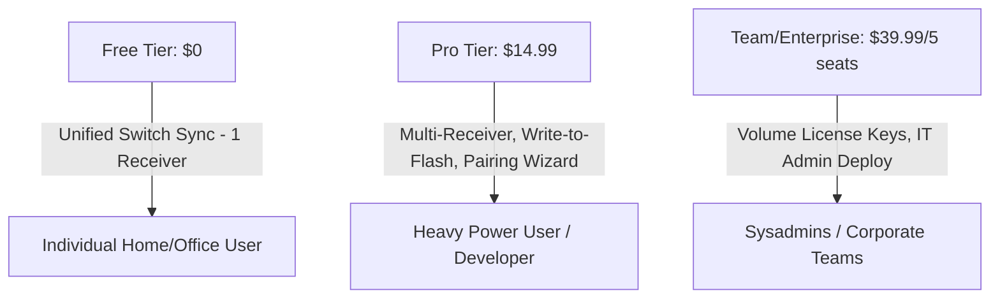

# BoltMate: Pricing Strategy & Targeted Reddit Marketing Plan

This document analyzes pricing models for **BoltMate** to maximize conversion and revenue, and outlines immediate organic marketing opportunities on Reddit and developer forums to drive early traffic.

---

## 1. Pricing Strategy & Model Recommendations

Since BoltMate targets power users who own premium Logitech peripherals (e.g., MX Master 3S at $100+, MX Keys S at $110+), the target demographic has a relatively high willingness to pay for utilities that save time and reduce friction.

### Competitive Price Anchoring

| Product | Pricing | Model | Core Target | Value Comparison |
| :--- | :--- | :--- | :--- | :--- |
| **Logitech Flow** | Free | Bundled | General users | Inconsistent, bloated, network-dependent. |
| **Rectangle Pro** | $9.99 | One-time | macOS window management | Core is free (Rectangle); Pro adds automation. Very successful. |
| **SteerMouse** | $19.99 | One-time | macOS mouse driver customization | High customization, paid major updates. |
| **Synergy (Symless)**| $29.00 - $59.00 | One-time | Cross-platform software KVM | Network-based, requires server setup. |
| **BoltMate (Proposed)**| **$14.99 (with 14-day trial)**| Freemium / One-time | Multi-device power users | Multi-channel network sync to mitigate VPN issues. |

---

### Recommended Pricing Tiers

We recommend a **Freemium model with a one-time license fee** rather than a subscription. Subscriptions for simple system utilities often trigger high user resistance.



#### Tier 1: Free Tier ($0)
*   **Goal:** Drive word-of-mouth adoption and GitHub stars.
*   **Included Features:**
    *   Unified switch sync on a single Bolt receiver.
    *   Logi Options+ coexistence (reads button events without blocking official software).
    *   System autostart manager.
    *   Device status monitoring (battery, connection type, serial numbers).

#### Tier 2: Pro Tier ($14.99 one-time)
*   **Goal:** Primary monetization channel.
*   **Why $14.99 instead of $9.99?**
    *   **Perceived Quality:** Technical users associate higher-priced utilities with better maintenance and support.
    *   **Hardware Anchor:** A user spending $200+ on input devices will not differentiate significantly between $9.99 and $14.99.
    *   **Included Features:**
        *   **Multi-Receiver Synchronization:** Coordinate host switches across multiple Bolt receivers (critical for home/office multi-monitor setups).
        *   **Receiver Management (Write-to-Flash):** Ability to pair, unpair, and clear device memory slots directly from the GUI (eliminating the need for official software).
        *   **Interactive Pairing Wizard:** Step-by-step UI with passcode prompts.
        *   **Advanced Hotkeys & Automation:** Ability to map custom scripts to Easy-Switch events.

> [!TIP]
> **Monetization Note:** Lemon Squeezy takes approximately 5% + $0.50 per transaction. At $14.99, the net payout is **$13.74** per sale, compared to **$8.99** at a $9.99 price point. This represents a **52.8% increase in net revenue per customer** for a negligible difference in friction.

---

## 2. Reddit & Forum Marketing: Finding the "Warmest" Traffic

To drive targeted traffic with a $0 budget, we need to locate users actively expressing pain points that BoltMate solves, particularly around **Logitech Flow** and **Easy-Switch**. 

### Target Subreddits & Audiences
1.  **r/logitech** (Official community, highly active with troubleshooting requests)
2.  **r/mac** / **r/macbook** (Users dealing with USB-C limits, Bluetooth instability, and Options+ bloat)
3.  **r/sysadmin** (Professionals managing secure workstations who cannot use network-dependent tools like Flow due to corporate firewalls/VPNs)
4.  **r/productivity** / **r/workfromhome** (Desk setup optimizers seeking seamless multi-computer transitions)

### Top 3 Specific Customer Pain Points to Target

#### 1. "Logitech Flow Not Working on Work VPN / Corporate Firewall"
*   **The Problem:** Logitech Flow relies on local network multicast packets (mDNS). If one machine is connected to a corporate VPN (common for work laptops), standard local networking is blocked or tunneled, breaking Flow.
*   **Our Solution:** BoltMate uses a dual-channel network coordination design specifically engineered to route traffic reliably even when one machine is on a VPN. We offer a **14-day free trial** so users can verify it works on their network topology before purchasing.

#### 2. "My Mouse Switches, but my Keyboard Doesn't Follow"
*   **The Problem:** Logitech's official "Enhanced Easy-Switch" sync only works from keyboard-to-mouse and is limited to specific newer models. If a user manual-switches their mouse, the keyboard remains on the old host.
*   **Our Solution:** BoltMate provides bidirectional coordination, ensuring both keyboard and mouse follow each other instantly regardless of which device triggers the switch.

#### 3. "Logi Options+ Memory Leak & CPU Spikes"
*   **The Problem:** Logi Options+ runs multiple background daemons (telemetry, AI assistants, brokers) that frequently spike to 15-20% CPU and leak memory up to 500MB+.
*   **Our Solution:** BoltMate is a native, lightweight executable built to run quietly in the tray, consuming less than 20-30MB of RAM and 0% idle CPU.

---

## 3. High-Conversion Outreach Templates

When commenting on Reddit, **do not spam.** Provide a helpful, technical explanation first, and then introduce BoltMate as a solution you built to solve this exact problem.

### Comment Template A: For VPN / Firewall Issues

```markdown
> "Logitech Flow requires both machines to be on the exact same network subnet without firewall blockades. Since you're on a corporate VPN, the network packets are being tunneled away, which breaks the connection.
> 
> A workaround is to use a tool that supports dual-channel networking to route around the VPN tunnel. I had this exact problem between my personal Mac and my work laptop, so I wrote a lightweight utility called **BoltMate** (https://github.com/[user]/BoltMate) to handle this.
> 
> It coordinates host switches over a specialized dual-channel setup designed to bypass common VPN blockades. There is a 14-day free trial available so you can check if it works for your specific work VPN config."
```

### Comment Template B: For Keyboard-Mouse Sync Issues

```markdown
> "Logitech's official Easy-Switch linking is unfortunately one-way (keyboard triggers mouse) and only supports a handful of their newest devices. If you switch channels on your mouse, the keyboard won't follow.
> 
> If you want true bidirectional switching, check out **BoltMate** (https://github.com/[user]/BoltMate). It's a lightweight tray app that intercepts the switch command and coordinates the switch across all paired devices instantly (even across multiple USB receivers). It runs in the background and takes up under 25MB of RAM."
```

---

## 4. Immediate Action Items

1.  **Search Queries for Reddit:** Save these search links to check weekly for new threads:
    *   `site:reddit.com/r/logitech "Flow" VPN`
    *   `site:reddit.com/r/logitech "Flow" firewall`
    *   `site:reddit.com/r/logitech keyboard follow mouse`
    *   `site:reddit.com/r/logitech Options+ memory leak`
2.  **Hacker News "Show HN":** Publish a technical write-up of BoltMate on Hacker News focusing on the HID++ 2.0 reverse engineering aspects (`0x1814` frames). Technical audiences on HN highly appreciate this and often share it on other subreddits.
3.  **Pricing Decision:** Confirm the $14.99 price point for Pro features and prepare the 14-day free trial on the Lemon Squeezy/licensing dashboard.
